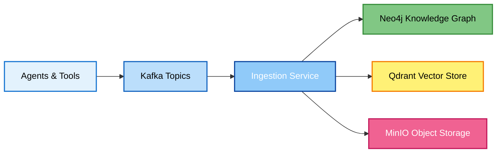

# Agent Development Stack

The Agent Development Stack (ADS) is a robust, and extensible backend designed to serve as the data and communication backbone for multi-agent AI systems that have to cooperate and model non-linear problem spaces. It is engineered to solve the core challenges of this type of computing: enabling inter-agent communication, building a shared, persistent knowledge base, and providing mechanisms for long-term memory.

ADS uses an event-driven model that allows individual agents to operate asynchronously. Agents publish their findings to a central message bus which gets processed by an ingestion layer to create artifacts in `neo4j`, `minio` and `qdrant`. As agents work they build a topology of the problem by publishing and reading updates. This shared model serves as the collective memory and ground-truth for all agents, enabling complex collaboration and emergent behavior without requiring agents to be directly aware of one another's existence or implementation.

<details>
  <summary><strong>Lore Diversion</strong></summary>

State-of-the-art (SOTA) AI models have seen steady and significant improvements over time, with advancements in scaling across pre-training, post-training, and inference showing no signs of slowing. The recent performances by OpenAI and Google at the [International Math Olympiad](https://www.imo-official.org/) (IMO) and the [AtCoder Heuristics World Championship](https://atcoder.jp/contests/awtf2025heuristic) clearly demonstrate that these models are capable of producing highly valuable outputs. To be honest, I think this has been clear for quite a long while.

Over the past few years, there has been a growing movement to connect tools to AI models and orchestrate workflows. Personally, I first developed an OpenAI integration for [BinaryNinja](https://binary.ninja/) in 2023, leveraging Windows API retrieval-augmented generation (RAG) to improve efficiency in reverse engineering tasks. As models have become more capable, they can now reliably handle an increasing range of tasks, even compensating for limitations in the frameworks that support them. In 2024, Anthropic formalized tool calling with their publication on the [Model Context Protocol](https://www.anthropic.com/news/model-context-protocol) (MCP), which has since spurred considerable MCP development both broadly and within the security community.

For today's SOTA models, linear tasks involving four or five tool calls are largely a solved problem (single context window → think → call → ... → produce answer). These linear processes can be chained together, which is both practical and highly useful. However, many research problems are open-ended, involve large volumes of data, require numerous tools, or suffer from context window limitations that reduce mental resolution.

Many of the most compelling challenges fall into this category. In the end, it's important to remember an old truth; there is always hard technical backend engineering work to do. ADS aims to support this need by providing a ready-to-use, extensible container that you can adapt for your own use cases.

**Resources**

- Anthropic | How we built our multi-agent research system - [here](https://www.anthropic.com/engineering/built-multi-agent-research-system)
- Roberto Rodriguez | Floki: Defining Agentic Workflows for Security - [here](https://www.youtube.com/watch?v=bOFe2MZfb4o)
- Off By One Security & Dreadnode | Building and Deploying Offensive Security Agents with Dreadnode - [here](https://www.youtube.com/watch?v=BzOmGw-LaR0)
- Arxiv | ReAct: Synergizing Reasoning and Acting in Language Models - [here](https://arxiv.org/abs/2210.03629)
- Arxiv | Unleashing the potential of prompt engineering for large language models - [here](https://arxiv.org/abs/2310.14735)
- Lilian Weng | LLM Powered Autonomous Agents - [here](https://lilianweng.github.io/posts/2023-06-23-agent/)
- Anthropic | Lessons on AI agents from Claude Plays Pokemon - [here](https://www.youtube.com/watch?v=CXhYDOvgpuU)
- Google | Prompting guide 101 - [here](https://services.google.com/fh/files/misc/gemini-for-google-workspace-prompting-guide-101.pdf)
- Google | Agents Companion - [here](https://www.kaggle.com/whitepaper-agent-companion)
- OpenAI | A practical guide to building agents - [here](https://cdn.openai.com/business-guides-and-resources/a-practical-guide-to-building-agents.pdf)

</details>

<p align="center">
  <br/>
  
  
  
  
  
  
</p>

## **Why though?**

Building multi-agent AI systems is complex. You need:
- **Agent Communication**: Reliable message passing between agents with guaranteed delivery and ordering
- **Shared Knowledge**: A unified, queryable data model all agents can read/write atomically  
- **Long-term Memory**: Persistent storage that grows smarter over time with semantic relationships
- **Semantic Search**: Find relevant information by meaning using vector similarity, not just keywords

This stack provides all of these capabilities out-of-the-box with a plugin architecture that makes integration straightforward.

## **Architecture Overview**



**Event-Driven Architecture:**
1. **Asynchronous Publishing**: Agents publish findings to Kafka topics without blocking
2. **Schema Validation**: Ingestion service validates and transforms data using Zod schemas
3. **Multi-Layer Persistence**: Plugins intelligently route data to appropriate storage layers
4. **Cross-Reference Linking**: Automatic relationship creation between graph, vector, and object data

This decoupled design enables horizontal scaling, fault tolerance, and independent agent development.

---

## **Service Endpoints**

Once running, these services are available for development:

### Neo4j Graph Database
| Interface | URL | Purpose |
|-----------|-----|---------|
| Browser UI | [https://localhost:7473/](https://localhost:7473/) | Query interface and visualization |
| Bolt Connection | `neo4j+ssc://localhost:7687` | Application database connection |

### Apache Kafka Event Bus  
| Interface | URL | Purpose |
|-----------|-----|---------|
| Client Connection | `localhost:19094` | SASL_SSL for external apps |

**Topics:** `tasks.raw-output`, `events.domain`, `events.dlq`

### Qdrant Vector Database
| Interface | URL | Purpose |
|-----------|-----|---------|
| Dashboard | [https://localhost:6333/dashboard](https://localhost:6333/dashboard) | Vector management interface |
| API | [https://localhost:6333](https://localhost:6333) | REST API |

### MinIO Object Storage
| Interface | URL | Purpose |
|-----------|-----|---------|
| Console | [https://localhost:9001/](https://localhost:9001/) | File management interface |
| API | [https://localhost:9000/](https://localhost:9000/) | REST API (S3 compatible) |

### Ingestion Service
| Interface | URL | Purpose |
|-----------|-----|---------|
| Metrics | [http://localhost:9100/metrics](http://localhost:9100/metrics) | Prometheus monitoring |

- **Authentication:** All services use credentials from your `.env` file.
- **SSL:** HTTPS endpoints use auto-generated self-signed certificates.

---

## 🚀 **Quick Start**

### 1. **Environment Setup**
```
# Copy example configuration
Copy-Item .env.example .env

# Edit .env with your preferred settings
# (passwords, ports, etc.)
```

### 2. **Start the Stack**

The stack includes two functionally equivalent management scripts that handle service orchestration automatically. These scripts contain custom logic to start/stop containers in the proper dependency order, wait for health checks, and clean up temporary initialization containers after deployment.

```
PS C:\> .\manage-stack.ps1
━━━━━━━━━━━━━━━━━━━━━━━━━━━━━━━━━━━━━━━━━━━━━━━━━━━━━━━━━━━━━━━━━━━━━━━━━━━━━━━━
  🚀 AI Agent Stack Management Script
━━━━━━━━━━━━━━━━━━━━━━━━━━━━━━━━━━━━━━━━━━━━━━━━━━━━━━━━━━━━━━━━━━━━━━━━━━━━━━━━

USAGE:
  .\manage-stack.ps1 -Build   # Build and start the stack
  .\manage-stack.ps1 -Start   # Start existing containers
  .\manage-stack.ps1 -Stop    # Stop all containers
  .\manage-stack.ps1 -Clean   # Remove containers and volumes
  .\manage-stack.ps1 -Help    # Show this help message

COMMANDS:
  -Build   Build the entire Docker stack with proper service ordering
           • Builds and starts all services
           • Waits for core services to be healthy
           • Starts ingestion service last
           • Cleans up init containers automatically

  -Start   Start existing containers in proper order
           • Starts core services first
           • Waits for core services to be healthy
           • Starts ingestion service last
           • No rebuilding - uses existing containers

  -Stop    Stop all running containers
           • Gracefully stops all services
           • Preserves data and container state

  -Clean   Remove all containers and volumes (DESTRUCTIVE)
           • Permanently deletes all containers
           • Removes all Docker volumes and data
           • Requires confirmation

EXAMPLES:
  # Build a fresh environment
  .\manage-stack.ps1 -Build

  # Restart stopped services
  .\manage-stack.ps1 -Start

  # Stop for maintenance
  .\manage-stack.ps1 -Stop

  # Complete reset (removes all data)
  .\manage-stack.ps1 -Clean
```

**Windows (PowerShell):**
```powershell
# Build and start all services with proper dependency handling
.\manage-stack.ps1 -Build

# Or restart existing containers
.\manage-stack.ps1 -Start
```

**Linux/Mac (Bash):**
```bash
# Build and start all services with proper dependency handling
./manage-stack.sh build

# Or restart existing containers  
./manage-stack.sh start
```

### 3. **Stop the Stack**

**Windows (PowerShell):**
```powershell
# Stop services (preserves data)
.\manage-stack.ps1 -Stop

# Complete reset (deletes all data)
.\manage-stack.ps1 -Clean
```

**Linux/Mac (Bash):**
```bash
# Stop services (preserves data)
./manage-stack.sh stop

# Complete reset (deletes all data)
./manage-stack.sh clean
```

> **💡 Pro Tips:**
> - Use `build` for first-time setup or after code changes  
> - Use `start`/`stop` for quick development cycles
> - Use `clean` to completely reset your environment
> - Scripts handle service dependencies and init container cleanup automatically

---

## **Core Components**

### **Apache Kafka** - Event Bus
- **Purpose**: Asynchronous message streaming between agents with exactly-once delivery
- **Key Features**: High-throughput (100k+ msgs/sec), fault-tolerant, ordered events, automatic partitioning
- **Architecture**: KRaft mode (no ZooKeeper), SASL/SCRAM + SSL encryption
- **Topics**: 
  - `tasks.raw-output`: Raw agent outputs (unvalidated JSON)
  - `events.domain`: Validated, structured events (Zod-validated schemas)
  - `events.dlq`: Failed processing attempts (with error context)

### **Neo4j** - Knowledge Graph  
- **Purpose**: Stores entities, relationships, and complex graph traversals
- **Key Features**: ACID transactions, Cypher query language, native graph algorithms
- **Performance**: Optimized for relationship queries, index-backed lookups, graph analytics
- **Use Cases**: Entity linking, multi-hop traversals, pattern matching, contextual reasoning

### **Qdrant** - Vector Database
- **Purpose**: High-performance semantic search and similarity matching  
- **Key Features**: HNSW indexing, filtered search, payload storage
- **Capabilities**: Multi-vector points, approximate nearest neighbor, real-time updates
- **Use Cases**: Embedding search, semantic retrieval, content similarity, clustering

### **MinIO** - Object Storage
- **Purpose**: Local storage (but S3 compatible) for large files and binary artifacts
- **Key Features**: Multi-part uploads, versioning, lifecycle policies, erasure coding
- **Performance**: High-throughput concurrent access, automatic load balancing
- **Use Cases**: Documents, binaries, model artifacts, large datasets

### **Ingestion Service** - Data Orchestration
- **Purpose**: Processes and intelligently routes data between storage layers
- **Key Features**: Plugin system, schema validation, error handling, dead letter queues
- **Architecture**: TypeScript with async/await, connection pooling, batch processing
- **Reliability**: Retry logic, circuit breakers, graceful degradation

---

## **Plugin System**

Extend the stack by creating plugins that handle new data types or sources. The plugin architecture provides strong separation of concerns and type safety.

### **Normalizer** 
Transforms raw tool output into standardized `DomainEvent` objects with full validation.
```typescript
import type { RawMessage, DomainEvent, INormalizer } from "../../core/schemas.js";

const normalize: INormalizer = (msg: RawMessage): DomainEvent[] | null => {
  // Zod schema validation with detailed error reporting
  // Deterministic fingerprint generation for idempotency
  // Multi-event generation from single input
  // Cross-reference ID creation for data linking
  return [event as DomainEvent];
};

export default normalize;
```

### **Upserter**
Writes validated events to appropriate storage layers with optimized queries.
```typescript  
import type { DomainEvent, IUpserter } from "../../core/schemas.js";

const upsert: IUpserter = async (event: DomainEvent): Promise<void> => {
  // Neo4j: MERGE operations for idempotent graph updates (prevents duplicates)
  // Qdrant: Vector upserts with metadata payload  
  // MinIO: Reference storage with presigned URL generation
  // Cross-layer referencing for unified data access
};

export default upsert;
```

### **Technical Benefits**
- **Type Safety**: Full TypeScript interfaces with compile-time validation (`INormalizer`, `IUpserter`)
- **Idempotency**: Deterministic fingerprints + MERGE patterns prevent duplicate processing
- **Atomicity**: Transaction support across storage layers

**👉 See [docs/ADDING_PLUGINS_NEW.md](docs/ADDING_PLUGINS.md) for detailed plugin development guide.**

---

## **CLI Testing Tools**

The stack includes command-line utilities for testing and interacting with individual components during development. These tools help verify data flow, execute queries, and debug issues across Kafka, Neo4j, Qdrant, and MinIO.

**👉 See [cli-test/](cli-test/) directory for available testing utilities.**

---

## **Technology Stack**

| Component | Technology | Why We Chose It | Technical Benefits |
|-----------|------------|-----------------|-------------------|
| **Application** | TypeScript | Type safety, excellent tooling | Compile-time validation, IDE support, refactoring safety |
| **Event Streaming** | Apache Kafka | Industry-standard, proven scale | Exactly-once delivery, horizontal scaling, durability |
| **Graph Database** | Neo4j | Best-in-class graph queries | Native graph algorithms, ACID transactions, Cypher language |
| **Vector Search** | Qdrant | High-performance, Rust-based | Memory efficiency, fast indexing, real-time updates |
| **Object Storage** | MinIO | S3-compatible, self-hosted | No vendor lock-in, high throughput, cost-effective |
| **Validation** | Zod | Runtime type checking | Schema evolution, detailed errors, TypeScript integration |
| **Orchestration** | Docker Compose | Simple multi-service deployment | Development parity, easy scaling, isolated environments |
